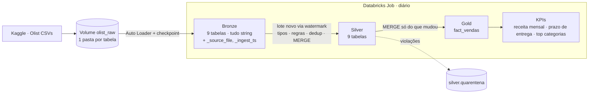
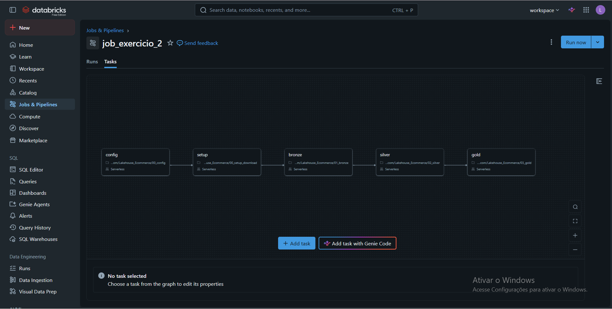
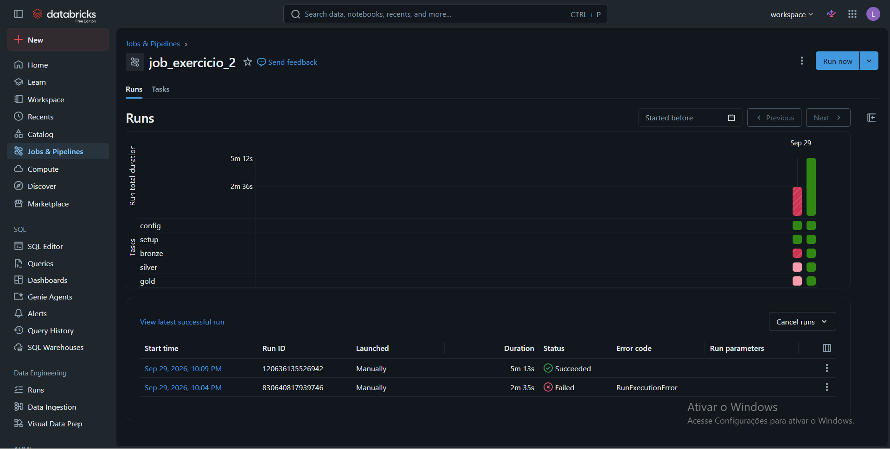
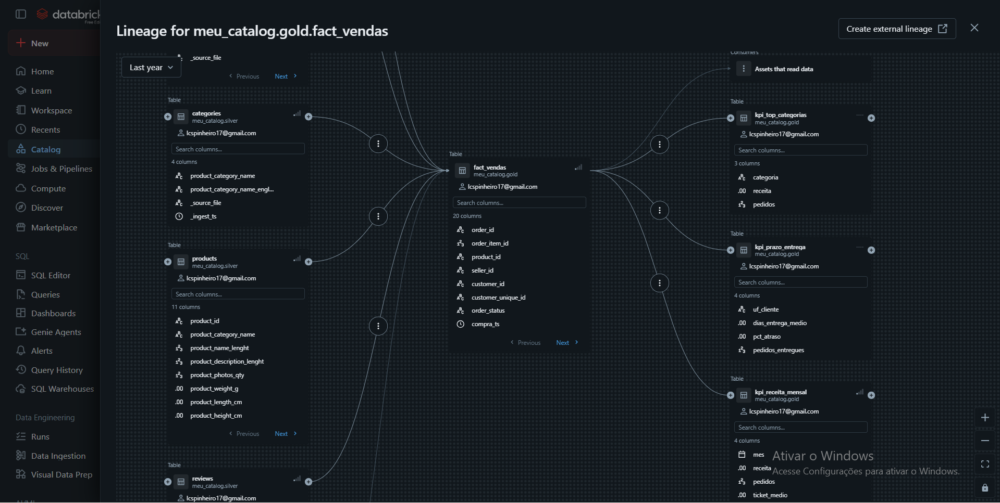
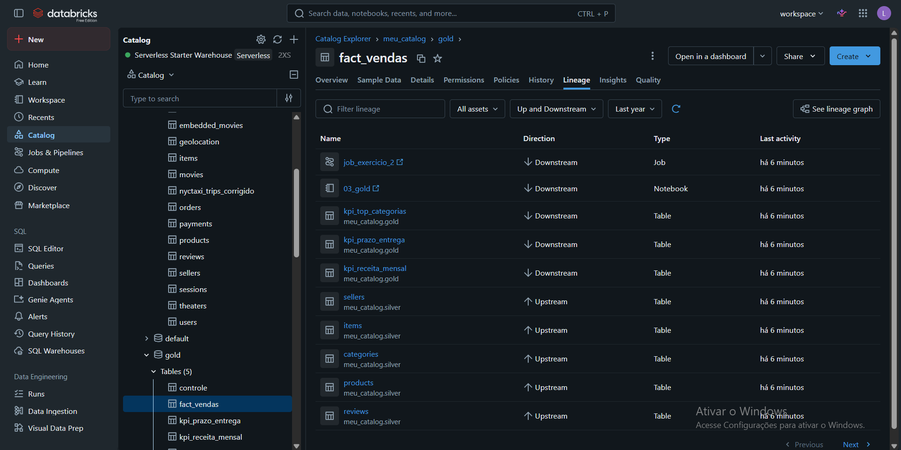

# Pipeline Olist · Arquitetura Medallion no Databricks

Pipeline incremental que leva os 9 CSVs do dataset Olist (e-commerce brasileiro, Kaggle) até indicadores de negócio:
**Bronze** (Auto Loader) → **Silver** (tipos, qualidade, quarentena, MERGE) → **Gold** (fato de vendas + KPIs),
orquestrado por um Job do Databricks. Todas as camadas são tabelas Delta consultáveis, com `COMMENT`.

## Arquitetura



## Estrutura

| Arquivo | Papel |
|---|---|
| `00_config.py` | Configuração compartilhada: catálogo, caminhos, mapa de arquivos e helpers (`tbl`, `comentar`, `bronze`) |
| `00_setup_download.py` | Roda **uma vez**: cria schemas e volumes, baixa o Olist do Kaggle no RAW e separa uma subpasta por tabela |
| `01_bronze.py` | Ingestão com Auto Loader (`availableNow`) para `bronze.*` |
| `02_silver.py` | Tipagem, regras de qualidade, quarentena, deduplicação e MERGE em `silver.*` |
| `03_gold.py` | `gold.fact_vendas` (MERGE) e KPIs |

## Pré-requisitos
- Workspace Databricks com Unity Catalog e acesso a Volumes (o notebook foi pensado para compute serverless).
- Um catálogo onde você possa criar schemas e volumes. Ajuste a variável `C` na configuração (`SHOW CATALOGS` lista os disponíveis).
- Download do Kaggle: em alguns ambientes o `kagglehub` exige `KAGGLE_USERNAME` e `KAGGLE_KEY`. Se falhar, baixe o zip manualmente e envie os CSVs para o volume `olist_raw`.

## Como executar do zero

1. **Configuração.** Cada notebook depende das definições de `00_config.py` (`C`, `RAW`, `CHK`, `ARQUIVOS`, `tbl`, `comentar`, `bronze`).
   Cole o conteúdo desse arquivo na primeira célula de `01_bronze`, `02_silver` e `03_gold` (o lugar está marcado com um comentário),
   ou use `%run ./00_config` sozinho numa célula. Colar é mais seguro no Job, porque cada tarefa roda em sua própria sessão.
2. **Setup (uma vez).** Rode `00_setup_download.py`. Ele cria `bronze/silver/gold`, os volumes `olist_raw` e `olist_chk`, baixa os dados e organiza `olist_raw/<tabela>/`.
3. **Pipeline.** Rode `01_bronze` → `02_silver` → `03_gold` em sequência, ou crie o Job abaixo.
4. **Conferência.** Contagens esperadas na Bronze:

| Tabela | Linhas |
|---|---|
| customers | 99.441 |
| orders | 99.441 |
| items | 112.650 |
| payments | 103.886 |
| reviews | 99.224 |
| products | 32.951 |
| sellers | 3.095 |
| geolocation | 1.000.163 |
| categories | 71 |

## Camadas

### Bronze
- Uma tabela por CSV, **tudo string** (`inferColumnTypes=false`), preservando o dado bruto.
- Metadados de ingestão: `_source_file` (arquivo de origem) e `_ingest_ts` (momento da ingestão).
- Auto Loader com `trigger(availableNow=True)`: processa o que chegou e encerra. O checkpoint guarda o progresso, então reexecutar **não duplica** dados.
- `multiLine` só em `reviews`, por causa das quebras de linha nos comentários. Nas demais tabelas ele impediria a leitura paralela.

### Silver
Para cada tabela: **ler só o novo → tipar → validar → deduplicar → MERGE**.
- **Novo** = linhas da Bronze com `_ingest_ts` acima do watermark guardado em `silver.controle` (por tabela). Sem dados novos, a tabela é pulada.
- **Tipagem** com `try_cast` e `try_to_timestamp`: valor inválido vira `NULL` (e depois cai numa regra), sem derrubar o job.
- **Padronização:** cidade em minúsculas e UF em maiúsculas, sem espaços nas pontas.
- **Regras de qualidade:** quem viola qualquer regra vai para `silver.quarentena` (tabela, regras violadas e o registro original em JSON) e não entra na tabela Silver.
- **Deduplicação** pelo registro mais recente (`_ingest_ts`) por chave; em `geolocation` usa `dropDuplicates`, mais barato para 1 milhão de linhas.
- **MERGE** na tabela de destino: insere o novo e só atualiza se o registro for mais recente.
- Saídas auxiliares: `silver.metricas_qualidade` (violações por tabela e regra) e uma conciliação `bronze = silver + quarentena + duplicatas removidas`.

| Tabela | Regras |
|---|---|
| orders | `order_id` e `customer_id` não nulos; status dentro do conjunto conhecido; compra entre 2016 e 2018; entrega não anterior à compra |
| items | pedido e produto existem na Silver; `price` ≥ 0; `freight_value` ≥ 0 |
| customers / sellers | id não nulo; UF com 2 letras |
| geolocation | coordenadas dentro do Brasil; UF com 2 letras |
| reviews | `review_id` não nulo; nota entre 1 e 5; duplicatas por `review_id` eliminadas |
| payments | `order_id` não nulo; valor ≥ 0 |
| products | `product_id` não nulo; peso ≥ 0 |
| categories | chave não nula |

### Gold
- **`fact_vendas`**, grão explícito: **1 linha por item de pedido** (`order_id` + `order_item_id`). Traz datas, valores, categoria (em inglês), UF de cliente e vendedor, dias de entrega, atraso e nota média da avaliação.
- Atualizada por **MERGE** só com itens ou pedidos novos ou alterados, usando o watermark de `gold.controle`.
- Pagamentos ficam de fora da fato para não multiplicar linhas (um pedido pode ter vários pagamentos).
- **KPIs** (recalculados só quando a fato mudou):
  - `kpi_receita_mensal`: receita, pedidos e ticket médio por mês.
  - `kpi_prazo_entrega`: dias médios de entrega e % de atraso por UF do cliente.
  - `kpi_top_categorias`: top 10 categorias por receita.
- Definição de receita: soma de `price` (sem frete), excluindo pedidos `canceled` e `unavailable`. Ticket médio = receita ÷ pedidos distintos.

## Incremental (2º lote)
O incremental está no próprio pipeline, não em script à parte:
- Bronze: o checkpoint do Auto Loader lê só arquivos novos.
- Silver e Gold: watermark + MERGE.

Para simular um lote 2, coloque arquivos novos em `olist_raw/<tabela>/` e rode o Job de novo. Exemplo (rode **uma vez**; regravar cria arquivos com nomes novos e o Auto Loader os leria de novo):

```python
ids = [r.order_id for r in bronze("orders").select("order_id").limit(1000).collect()]
for pasta in ("orders", "items"):
    df = bronze(pasta)
    df = df.filter(F.col("order_id").isin(ids)).select(*[c for c in df.columns if not c.startswith("_")])
    (df.withColumn("order_id", F.concat("order_id", F.lit("-L2")))
       .coalesce(1).write.mode("overwrite").option("header", True)
       .csv(f"{RAW}/{pasta}/lote2"))
```

Prova de que não duplica: conte as linhas de `bronze.orders`, `silver.orders` e `gold.fact_vendas` antes do lote 2, depois de rodar com o lote 2 (devem subir) e depois de rodar de novo sem arquivos novos (devem ficar iguais).

## Orquestração (Job)
Job com 3 tarefas do tipo Notebook, com dependências e agendamento:

| Tarefa | Notebook | Depende de |
|---|---|---|
| `bronze` | `01_bronze` | — |
| `silver` | `02_silver` | `bronze` |
| `gold` | `03_gold` | `silver` |

Agendamento diário (por exemplo, 06:00). Linhagem: Catalog Explorer → `gold.fact_vendas` → aba **Lineage** → *See lineage graph*.

## Recomeçar do zero
A Silver e a Gold guardam watermark. Se apagar as tabelas, apague também as tabelas de controle, senão elas acham que já processaram tudo:

```sql
-- Silver
DROP TABLE IF EXISTS meu_catalog.silver.categories;
DROP TABLE IF EXISTS meu_catalog.silver.customers;
DROP TABLE IF EXISTS meu_catalog.silver.sellers;
DROP TABLE IF EXISTS meu_catalog.silver.products;
DROP TABLE IF EXISTS meu_catalog.silver.geolocation;
DROP TABLE IF EXISTS meu_catalog.silver.orders;
DROP TABLE IF EXISTS meu_catalog.silver.items;
DROP TABLE IF EXISTS meu_catalog.silver.payments;
DROP TABLE IF EXISTS meu_catalog.silver.reviews;
DROP TABLE IF EXISTS meu_catalog.silver.quarentena;
DROP TABLE IF EXISTS meu_catalog.silver.metricas_qualidade;
DROP TABLE IF EXISTS meu_catalog.silver.controle;
-- Gold
DROP TABLE IF EXISTS meu_catalog.gold.fact_vendas;
DROP TABLE IF EXISTS meu_catalog.gold.kpi_receita_mensal;
DROP TABLE IF EXISTS meu_catalog.gold.kpi_prazo_entrega;
DROP TABLE IF EXISTS meu_catalog.gold.kpi_top_categorias;
DROP TABLE IF EXISTS meu_catalog.gold.controle;
```

Para refazer também a Bronze, apague as tabelas `bronze.*` e as pastas de checkpoint da Bronze no volume `olist_chk` (`<tabela>/schema` e `<tabela>/checkpoint`).

## Decisões e limitações
- Bronze sem transformação: permite reprocessar a Silver a qualquer momento.
- Quarentena em vez de descarte: os registros ruins ficam auditáveis, com as regras violadas.
- Integridade de itens depende da ordem: um item que chega antes do seu pedido, em lote anterior, vai para a quarentena.
- Mudanças apenas em clientes, vendedores, produtos ou categorias não atualizam linhas antigas da `fact_vendas`.
- Duplicatas por chave são resolvidas pelo `_ingest_ts` mais recente.

## Evidências

### Job com as 3 tarefas (bronze → silver → gold)


### Execução bem-sucedida do Job


### Linhagem da tabela `gold.fact_vendas` (grafo)


### Linhagem da tabela `gold.fact_vendas` (lista)
